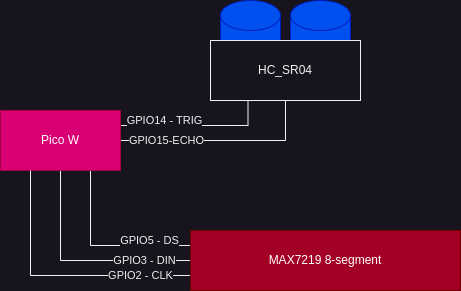
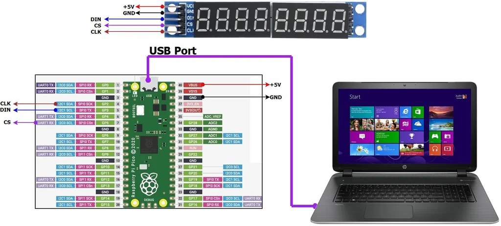

# PHS
PHS (or Python Height Sensor) is a repository where JonBoan And NoIDidntHackU will work together to make the code and schematics for the Digital height detector based on python on the Raspberry Pi Pico W





Circuit Layout 



## Setup 

- Setup [Thonny](https://thonny.org/)
- Install the firmware on Pico - TODO - find the reference
- Plugin the Pico
- Add the `max7219_8digit.py` to the Pico via `Files` in Thonnny


## MAX7219 Demo

Here is some *example* code `max7219_demo.py`


```python
from machine import Pin, SoftSPI
import max7219_8digit


spi = SoftSPI(baudrate=100000, polarity=1, phase=0, sck=Pin(2), mosi=Pin(3), miso=Pin(0))
ss = Pin(5, Pin.OUT)
display = max7219_8digit.Display(spi, ss)

display.write_to_buffer("12.34")
display.display()
```

__WOW__